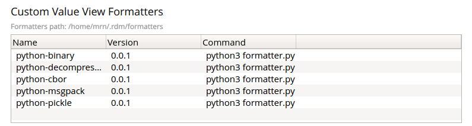

## Native value formatters

> !!! warning "macOS"
    This feature is not available in the Apple AppStore version due to sandboxing restrictions.    

Native value formatters are scripts or executables developed in different programming languages which allow
 to display in readable form the key values of various formats inside the RDM value editor. You can easily implement any formatter for your own purposes as well. 


**Advantages:**
- Plugin can be developed by any software engineer (Java/C++/C#/Python/PHP/Node.js etc)
- Plugin can be easily debugged

### How to implement native value formatter
1. Create directory with meaningful name. Name of the directory will be used as formatter name.
2. Implement script or executable which meets protocol described below. 
3. Add file `usage.json` with usage shell command<br />
For example for python script it will be: `['python', 'my_super_formatter.py']`
4. Test your formatter in RDM!

### Protocol
#### Formatter info:

CMD: `<executable> info`

STDOUT (json):

```
{
    "version": "1.0.0",
    "description": "Formatter description",
    "read-only": true
}
```
If `read-only` property is absent - `true` is used as default value for this property.
If `read-only` property is `false` - formatter will be showed in `Add New Key` and `Add Row` dialogs.


#### Decode binary data:  

CMD: `<executable> decode`

STDIN: `<binary-data-encoded-with-base64>`

STDOUT (json): 

```
{
    “output”: “<decoded data for human-friendly edit>”,
    “read-only”: “false”,    
    “format”: “plain_text” // or “json”
}
```
#### Encode string-representation 
**Required only for formatters which return `“read-only”: true`**

CMD: `<executable> encode`

STDIN : `<edited-string-representation-encoded-with-base64>`

STDOUT (json): 
```
{
    “output”: “<binary-data-encoded-with-base64>”,    
}

```

#### Error handling:
If formatter cannot decode/encode value error response should be returned:

OUT (json): 
```
{
    “error”: “Invalid CBOR data”,    
}
```

### Installation

To install the formatter create `formatters/` directory inside of `.rdm/` settings directory which is by default located inside of your home directory or by the path you specify as `--settings-dir` option when you run RDM. Then copy formatter's directory into `.rdm/formatters/`. Or just clone the repository with examples into `.rdm/` like shown below.

```shell
cd ~/.rdm/
git clone https://github.com/RedisDesktop/rdm-native-value-formatters.git formatters
```


### How to verify installation

To verify that the formatter is installed go to Settings and check the table titled "Custom Value View Formatters" for desired formatter presence.



### How to use

Click on the key to open the value editor and choose the appropriate formatter from the "View as:" drop-down menu.

### Thirdparty formatters

You can find more formatters on [Github](https://github.com/search?q=redis+desktop+manager+formatter).


